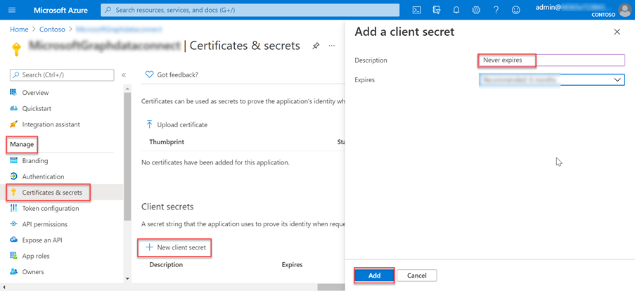

In this exercise you will create, execute, and approve an Azure Data Factory pipeline to extract data from Office 365 to an Azure Storage Blob for additional processing.

## Create an Azure Active Directory application registration

The first step is to create an Azure AD application that will be used as the security principal to run the data extraction process.

1. Open a browser and navigate to your [Azure Portal](https://portal.azure.com/).
2. Login using an account with **Global Administrator** rights to your Azure and Office 365 tenants.
3. Select **Azure Active Directory** (Azure AD) from the sidebar navigation.
4. On the Azure AD Overview page, select **App registrations** from the **Manage** section of the menu.
5. Select the **New application registration** button:

6. Use the following values to create a new Azure AD application and select **Register**:
   - **Name**: Microsoft Graph Data Connect Data Transfer
   - **Supported account types**: Accounts in this organizational directory only.
   - **Redirect URI**: Leave the default values.
    
7. Locate the **Application (client) ID** and copy it as you will need it later in this lab. This will be referred to as the service principal ID.
8. Locate the **Directory (tenant) ID** and copy it as you will need it later in this lab. This will be referred to as the tenant ID.
9. Select **Certificates and secrets** under **Manage** in the sidebar navigation.
10. Select the **New client secret button**. Set *Description* to _Never expires_, set **Expires** to _Never_ and choose **Add**.
    > [!IMPORTANT]
    > You can choose different values for **Description** and **Expires** if you like, but ensure you keep a copy of the name and the hashed key after it is saved as the hashed value will never be shown again and you will need to create a new key as it is needed later in the lab.

    
    This will be referenced as the service principal key.
11. Using the sidebar navigation for the application, select **Owners**.
12. Ensure your account is listed as an owner for the application. If it isn't listed as an owner, add it.

