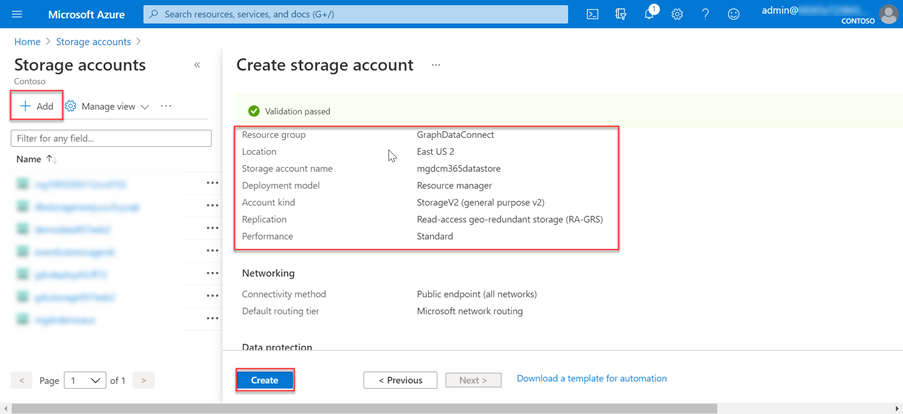
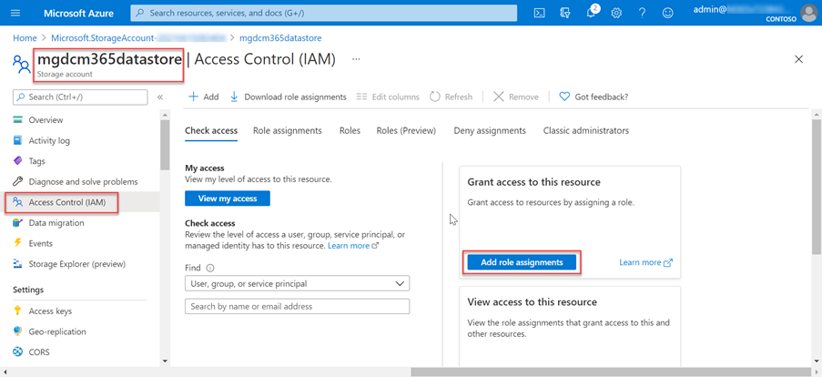

# Setup your Azure Storage resource for Microsoft Graph Data Connect

## Create Azure Storage Blob

In this step you will create an Azure Storage account where Microsoft Graph data connect will store the data extracted from Office 365 for further processing.

1. Open a browser and navigate to your [Azure Portal](https://portal.azure.com/).
2. Login using an account with **Global Administrator** rights to your Azure and Office 365 tenants.
3. Select **Create a resource** from the sidebar navigation.

4. Find the **Storage Account** resource type and use the following values to create it, then select **Review + create**:
    1. **Subscription**: select your Azure subscription
    1. **Resource group**: GraphDataConnect (or select an existing resource group)
    1. **Storage account name**: mgdcm365datastore
    1. **Location**: pick an Azure region in the same region as your Office 365 region
    1. **Performance**: Standard
    1. **Account kind**: StorageV2 (general purpose v2)
    1. **Replication**: Read-access geo-redundant storage (RA-GRS)
    1. **Access tier**: Hot
5. Review that the settings match those shown in the previous step and select **Create**.

6. Once the Azure Storage account has been created, grant the Azure AD application previously created the proper access to it.
    1. Select the **Azure Storage account**.
    2. In the sidebar menu, select **Access control (IAM)**.
    
    3. Select the **Add** button in the **Add a role assignment** block.
    4. Use the following values to find the application you previously selected to grant it the **Storage Blob Data Contributor** role, then select **Save**:
        1. **Role**: Storage Blob Data Contributor
        2. **Assign access to**: Azure AD user, group or service principal
        3. **Select**: Microsoft Graph data connect Data Transfer (the name of the Azure AD application you created previously)
        
7. Create a new container in the **mgdcm365datastore** Azure Storage account:
    1. Select the **mgdcm365datastore** Azure Storage account.
    2. In the sidebar menu, select **Containers** under the **Blob** service section.
    3. Select the **+Container** button at the top of the page and use the following values and then select **Create**:
       1. **Name**: m365mails
       2. **Public access level**: Private (no anonymous access)
       
