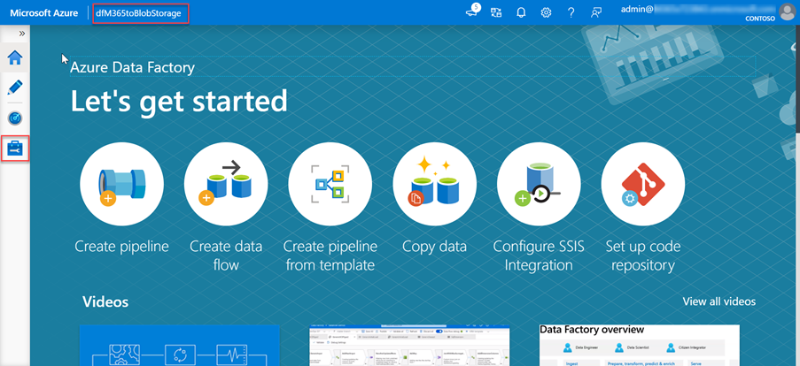
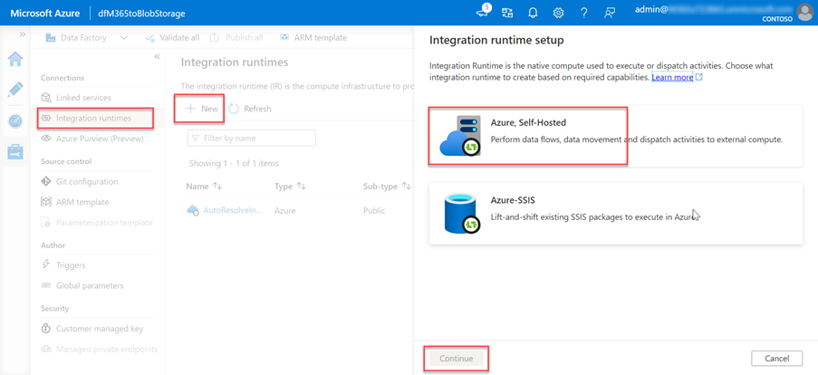
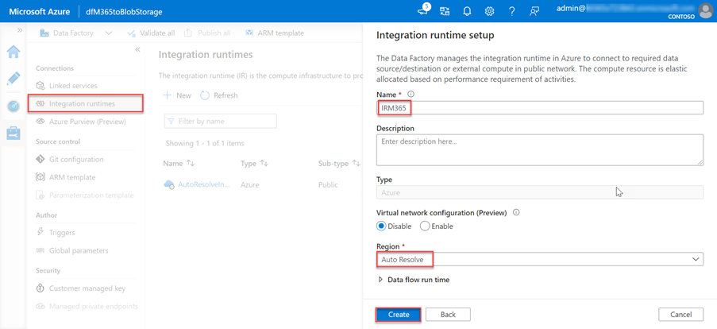
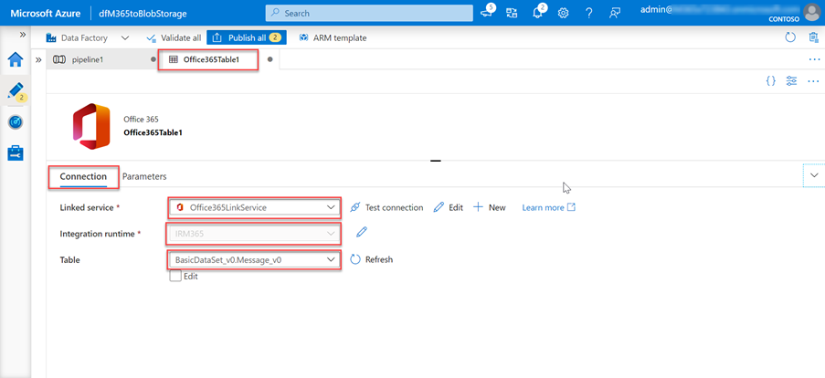

# Setup your Azure Data Factory resource for Microsoft Graph Data Connect

## Create an Azure Data Factory pipeline

The next step is to use the Azure Data Factory to create a pipeline to extract the data from Office 365 to the Azure Storage account using Microsoft Graph data connect.

1. Open a browser and navigate to your [Azure Portal](https://portal.azure.com/).
2. Login using an account with **Global Administrator** rights to your Azure and Office 365 tenants.
    > [!NOTE]
    > Keep track of the user you are using in this step as you will need to switch to the other user you granted the **Global Administrator** role and that has multi-factor authentication enabled on their account in a later step.
3. Select **Create a resource** from the sidebar navigation.
4. Find the **Data Factory** resource type and use the following values to create it, then select **Create**:
    1. **Name**: dfM365toBlobStorage
    1. **Subscription**: select your Azure subscription
    1. **Resource group**: GraphDataConnect
    1. **Version**: V2
    1. **Location**: pick an Azure region in the same region as your Office 365 region
    
5. Once the Azure Data Factory resource is created, select the **Author and Monitor** tile to launch the Azure Data Factory full screen editor.

6. Switch from the **Overview** to the **Manage** experience by selecting it from the left-hand navigation:

7. **Optional step**. By default, the Azure Data Factory will use an Integration Runtime that is auto resolving the region. As the Microsoft Graph Data Connect requires that your source and destination, and integration runtime to exist in the same Office 365 region, it is recommended that you create a new Integration Runtime with a fixed region.
    1. Select **Integration runtimes** > **New**.
    1. Select **Azure**, **Self-Hosted** and select **Continue**.
    
    1. Select **Azure** for network environment and select **Continue**.
    
    1. Use the following details to complete the form on the final screen and then select Create:
        - **Name**: name of your integration runtime
        - **Description**: enter a description
        - **Region**: select the region that matches your Office 365 region
        
8. Switch from the **Manage** to the **Author** experience by selecting it from the left-hand navigation and create a new pipeline by selecting the **plus** icon, then **pipeline**:
   
    1. Drag the **Copy Data** activity from the **Move and Transform** section onto the design surface:
    
    1. Select the activity in the designer.
    1. In the activity editor pane below the designer, select the **Source** tab, then select **New**.
    1. Locate the dataset **Office 365**, select it and then select the **Continue** button.
    
    1. The designer will create a new tab for the Office 365 connector. Select the **Connection** tab in the connector's editor, then the **New** button.
    1. In the dialog that appears, enter the previously created Azure AD application's **Application ID** and **Password** in the **Service principal ID** and **Service principal key** fields, then select **Finish**.

        > [!TIP]
        > If you created a dedicated Integration Runtime, select it in the Connect via integration runtime dropdown.

        
    1. After creating the Office 365 connection, for the **Table** field, select **BasicDataSet_v0.Message_v0**.
    
    1. Switch from **Office365Table** to **Pipeline > Source**. Use the following values for the **Date filter**.
      <!-- I am here. Resume tomorrow from here and finish section. -->
      - **Column Name**: CreatedDateTime
      - **Start time (UTC)**: select a date sometime prior to the current date
      - **End time (UTC)**: select the current date
    1. Select -the Schema tab and then select Import Schema.
    1. With the source configured for your copy data activity, now configure the sink, or the location where data will be stored.
        Select the tab in the designer for your pipeline.
    1. Select the copy data activity, then select the sink tab:
    1. Select the New button, select Azure Blob Storage, and then select the Continue button.
    1. Select Json as the format for the data and then select the Continue button.
    1. Given dataset name to M365JsonFile and create new link service if not exists.
        1. Select the Connection tab, then select New.
        2. Set the following values in the dialog, then select Finish:
            - **Authentication method**: Service principal
            - **Azure subscription**: Select all
            - **Storage account name**: [tenantid]gdcdump
            This is the storage account created earlier in this exercise.
            - **Tenant**: enter the ID of your Azure tenant
            - **Service principal ID**: enter the ID of the Azure AD application you previously created
            - **Service principal key**: enter the hashed key of the Azure AD application you previously created
            NOTE: If you created a dedicated Integration Runtime, select it in the Connect via integration runtime dropdown.
        3. Next to the File path field, select Browse.
        4. Select the na-me of the storage container you created previously.
        5. Ensure the File format is set to JSON format.
        6. Set the File pattern to Set of objects.
9. With the pipeline created, select the Validate All button at the top of the designer.
10. After validating (and fixing any issues that were found), select the Publish All button at the top of the designer.

## Execute the Azure Data Factory Pipeline

With the pipeline created, now it's time to execute it.
NOTE: It can take several minutes for the consent request to appear and it is not uncommon for the entire process (start, requesting consent and after approving the consent completing the pipeline run) to take over 40 minutes.

1. In the Azure Data Factory designer, with the pipeline open, select Add trigger > Trigger Now:
2. After starting the job, from the sidebar menu, select Monitor to view current running jobs:
3. Locate the pipeline run you just started in the list. In the Actions column, select the View Activity Runs icon:
4. On the Activity Runs screen, you will see a list of all the activities that are running in this pipeline. Our pipeline only has one activity that should show as currently In Progress.
While the status may show as In Progress, the request may be paused internally as the request for access to the data in Office 365 may need to be approved. You can see if this is the case by selecting the Details icon in the Actions column.
5. In the Details screen, look for the status of the pipeline activity as highlighted in the following image. In this case you can see it is in a state of RequestingConsent:
At this point, the activity run is internally paused until someone manually approves the consent request.
