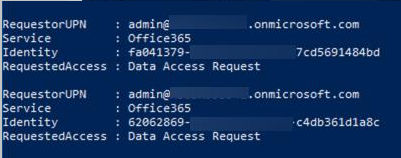

<!-- markdownlint-disable MD002 MD041 -->

An Office 365 administrator has the ability to approve or deny consent requests. This can be done using the Microsoft 365 Admin Center or you can also achieve this in a more programmatic way using PowerShell.

## Approve Office 365 consent requests via M365 Admin Center

> [!NOTE]
> NOTE: You can alternatively approve consent requests using Windows PowerShell which is demonstrated in the next section.

1. Open a browser and navigate to your [Microsoft 365 Admin Portal](https://admin.microsoft.com).

1. To approve or deny consent requests, please go to [Privileged Access](https://portal.office.com/adminportal/home#/Settings/PrivilegedAccess).

1. Select a pending **Data Access Request**.

1. In the **Data Access Request** call out, select the **Approve** button.

<!-- Pending SS from Pratik -->

## Approve Office 365 consent requests via PowerShell

> [!NOTE]
> If you approved the request using the Microsoft 365 Admin Center, you can skip this section.
> In this step you will use Exchange Online PowerShell to find data requests that are pending consent and approve them so the Azure Data Factory pipeline(s) can continue.

1. Open Windows PowerShell.
1. Ensure your PowerShell session has enabled remotely signed scripts:

    ```powershell
    Set-ExecutionPolicy RemoteSigned
    ```

1. Connect to Exchange Online:

    1. Obtain a login credential by executing the following PowerShell. Login using a different user than one that created & started the Azure Data Factory pipeline, who has the global administrator role applied, who is a member of the group that has rights to approve requests to data in Office 365, and has multi-factor authentication enabled:

        ```powershell
        $UserCredential = Get-Credential
        ```

    1. Create a new Exchange Online PowerShell session & load (import) it:

        ```powershell
        $Session = New-PSSession -ConfigurationName Microsoft.Exchange -ConnectionUri https://ps.protection.outlook.com/powershell-liveid/ -Credential $UserCredential -Authentication Basic -AllowRedirection
        Import-PSSession $Session -DisableNameChecking
        ```

        > [!IMPORTANT]
        > Once you are finished with this session, be sure you you disconnect from the session using the PowerShell command Remove-PSSession $Session. Exchange Online only allows for three open remote PowerShell sessions to protect against denial-of-service (DoS) attacks.

        > [!NOTE]
        > If you simply close the PowerShell window, it will leave the connection open.

1. Get a list of all pending data requests from Microsoft Graph data connect by executing the following PowerShell:

    ```powershell
    Get-ElevatedAccessRequest | where {$_.RequestStatus -eq 'Pending'} | select RequestorUPN, Service, Identity, RequestedAccess | fl
    ```

    - Examine the list of data access requests returned. In the following image, notice there are two pending requests:

        

1. Approve a data access returned in the previous step by copying the Identity GUID of a request by executing the following PowerShell:

    > [!NOTE]
    > Replace the GUID in the following code snippet with the GUID from the results of the previous step.

    ```powershell
    Approve-ElevatedAccessRequest -RequestId fa041379-0000-0000-0000-7cd5691484bd -Comment 'approval request granted'
    ```

1. After a few moments, you should see the status page for the activity run update to show it is now extracting data:

    

1. This process of extracting the data can take some time depending on the size of your Office 365 tenant.

## Verify extracted data from Office 365 to Azure Storage Blob

1. Open a browser and navigate to your [Azure Portal](https://portal.azure.com/).

1. Login using an account with global administrator rights to your Azure and Office 365 tenants.

1. Select the **All resources** menu item from the sidebar navigation.

1. In the list of resources, select the **Azure Storage account** you created previously in this lab.

1. On the **Azure Storage account** blade, select **Blobs** from the sidebar menu.

1. Select the **container** created previously in this lab that you configured the Azure Data Factory pipeline as the sink for the extracted data. You should see data in this container now:

    
